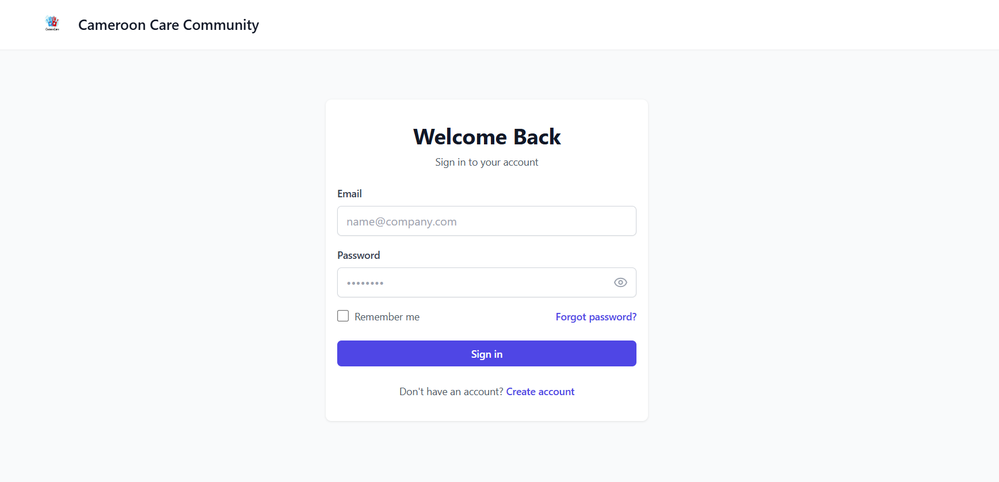
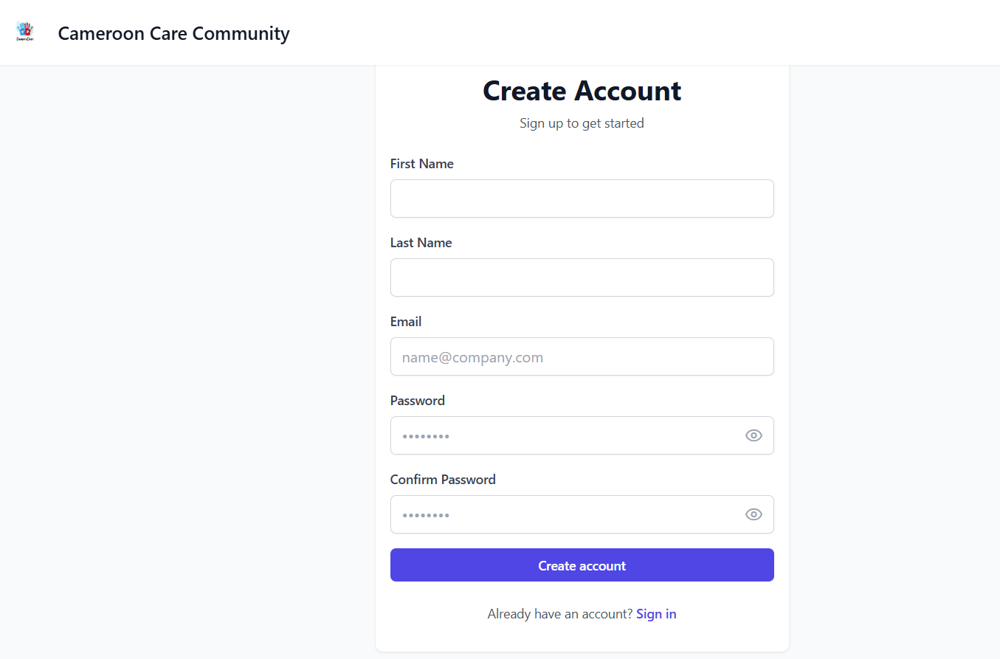
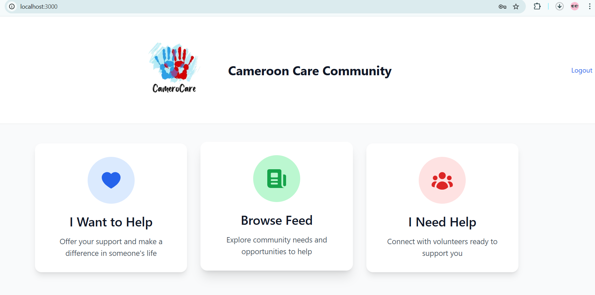
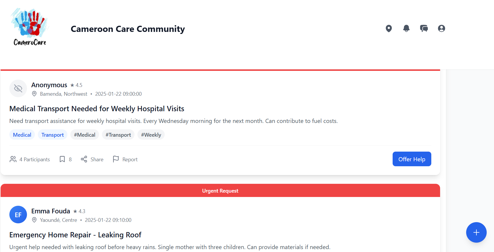
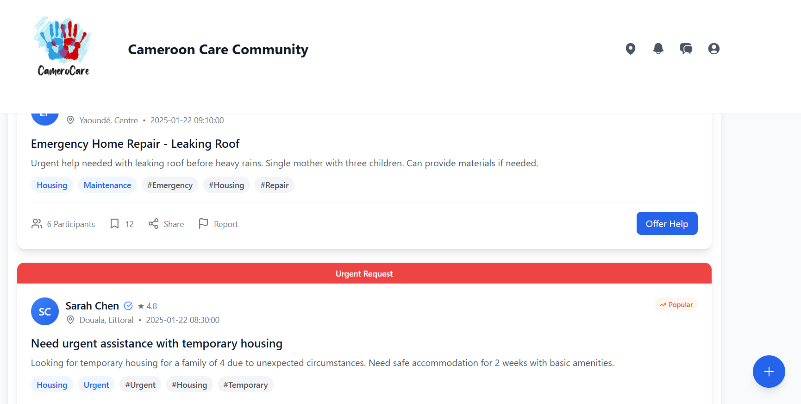
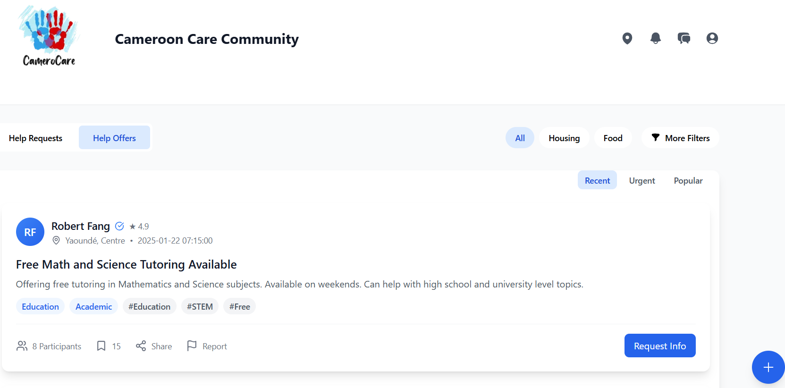
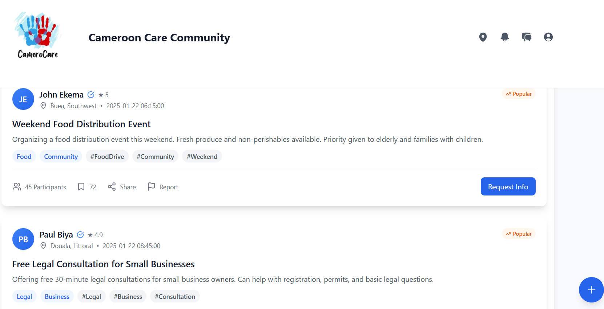

# CameroCare
This is a Cameroon community service platform where People can provide help and request help.

It's design in such a way where both those who help and request help choose the category of help they need or can provide then appears in a social media like form as a post with name of the person, the categories and his location an appear as a feed.

Those who request help would be limited to 3 categories but Helpers can't provide as many categories at their will.

## Getting Started
Installing packages :
```bash
npm install @headlessui/react@^2.2.0 @heroicons/react@^2.2.0 @prisma/client@^6.2.1 @radix-ui/react-tabs@^1.1.2 bcrypt@^5.1.1 bcryptjs@^2.4.3 clsx@^2.1.1 date-fns@^4.1.0 lodash@^4.17.21 lucide-react@^0.471.1 mongodb@^6.12.0 mongoose@^8.9.5 next@^15.1.4 next-auth@^4.24.11 react@^19.0.0 react-dom@^19.0.0 react-icons@^5.4.0 socket.io-client@^4.8.1 tailwind-merge@^2.6.0

npm install -D @eslint/eslintrc@^3 @types/bcrypt@^5.0.2 @types/bcryptjs@^2.4.6 @types/lodash@^4.17.14 @types/next@^8.0.7 @types/node@^20 @types/react@^19 @types/react-dom@^19 eslint@^9 eslint-config-next@15.1.4 postcss@^8 tailwindcss@^3.4.1 typescript@^5

```
## connecting with mongodb locally for the authentification
create a database on the MongoDB compass 
copy the string link (e.g "mongodb://localhost:27017/your-database")
create a an environment variable .env.local and put :
```javascript
MONGODB_URI=mongodb://localhost:27017/CameroCare
NEXTAUTH_URL=http://localhost:3000

```

If the package.json is properly configured and contains the dependencies, you can install them all at once by running:

```bash

npm install

```

First, run the development server:

```bash
npm run dev
# or
yarn dev
# or
pnpm dev
# or
bun dev
```
Open [http://localhost:3000](http://localhost:3000) with your browser to see the result.

You can start editing the page by modifying `app/page.tsx`. The page auto-updates as you edit the file.

## Technologies Used

- **Frontend**: [typescript] [javascript]
- **Styling**: [Tailwind]
- **Hosting**: Deployed using [Github] / [vercel]


## screenshot
[SIGNIN]


[SIGNUP]


[PAGE_LAYOUT]


[Feed_HelpRequst]



[Feed_helpoffer]



## Contact

Feel free to reach out with feedback or inquiries:

- **Email**: [e.bryandze@gmail.com]
- **X** : [https://x.com/dze_bryan]
- **LinkedIn**: [www.linkedin.com/in/dzebryan237]
- **GitHub**: [https://github.com/G-Bryan237]

---

Thank you for visiting my website!

